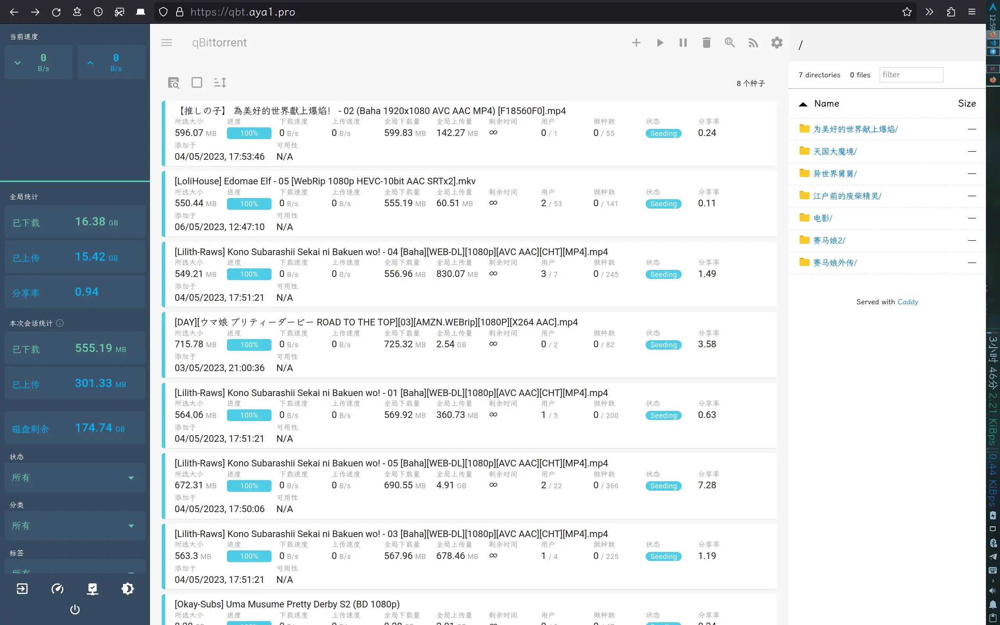

# 国内服务器搭建网站绕过备案（伪）

> 看了竹林的[《隐式转发——骚套路建站方案》](https://zhul.in/2023/03/26/implicit-forwarding-is-a-new-site-deploying-method/)后有感

## 1. 在 80/443 端口不可用的服务器上申请证书

```bash
# 更改默认证书提供商为 letsencrypt
acme.sh --set-default-ca --server letsencrypt
```

### 使用域名商api [DNS-api-mode](https://github.com/acmesh-official/acme.sh/wiki/How-to-issue-a-cert#4-dns-api-mode)
```bash
# 设置 api key，如cloudflare：https://dash.cloudflare.com/profile/api-tokens
export CF_Key='xxxxxxxxxxxxxxxxxxxxxxxxxxxxxxxxxxxxxxxxxxx'
export CF_Email='example@example.com'
# 运行命令，生成证书
acme.sh --issue --dns dns_cf -d "mydomain.com" -d "*.mydomain.com"
```

### 不使用域名商api，手动模式 [DNS-manual-mode](https://github.com/acmesh-official/acme.sh/wiki/DNS-manual-mode)
```bash
# 运行命令，根据提示在 dns 后台修改 txt 解析
acme.sh --issue --dns -d mydomain.com --yes-I-know-dns-manual-mode-enough-go-ahead-please
# 生成证书
acme.sh --renew -d mydomain.com --yes-I-know-dns-manual-mode-enough-go-ahead-please
# 转换证书（可选）
acme.sh --installcert -d mydomain.com --key-file /path/xxx.key --fullchain-file /path/xxx.crt
```

## 2. 在非 443 端口部署 https 网页

Caddyfile 示例：

```json
https://t2-file.aya1.pro:2000 {
        encode gzip
        tls /path/to/t2-file.aya1.pro.cer /path/to/t2-file.aya1.pro.key
        root * /home/aya/data/qbit
        file_server browse {
                hide config vuetorrent
        }
}
https://t2-qbit.aya1.pro:2000 {
        encode gzip
        tls /path/to/t2-qbit.aya1.pro.cer /path/to/t2-qbit.aya1.pro.key
        reverse_proxy localhost:2080 {
                header_down -X-Frame-Options
                header_down -Content-Security-Policy
        }
}
```
此时，已经可以直接在浏览器访问 https://t2-file.aya1.pro:2000 和 https://t2-qbit.aya1.pro:2000 了，如果还要隐藏端口可以看下面两步

## 3. 新建 index.html
例1: 两个网页左右分屏
```html
<!doctype html>
<title>Ayayaya～</title>
<html lang="en">

<frameset cols="80%,*" frameborder="0">
    <frame src="https://t2-qbit.aya1.pro:2000/">
    <frame src="https://t2-file.aya1.pro:2000/">
</frameset>

</html>
```
例2: 一个网页，如果浏览器不支持 iframe 则显示跳转链接
```html
<!DOCTYPE html>
<html lang="en">

<head>
    <meta charset="UTF-8">
    <meta name="viewport" content="width=device-width, initial-scale=1.0">
    <title>Aya's File</title>
</head>

<frameset rows="100%">
    <frame src="https://t2-qbit.aya1.pro:2000/">
        <noframes><a href="https://t2-qbit.aya1.pro:2000/">Click here</a></noframes>
</frameset>

</html>
```

## 4. 部署到 Cloudflare Pages

或其他可以提供静态网页部属的服务，略

## 5. 实际效果

~~[https://qbt.aya1.pro/](https://qbt.aya1.pro/)~~ 已关闭

​