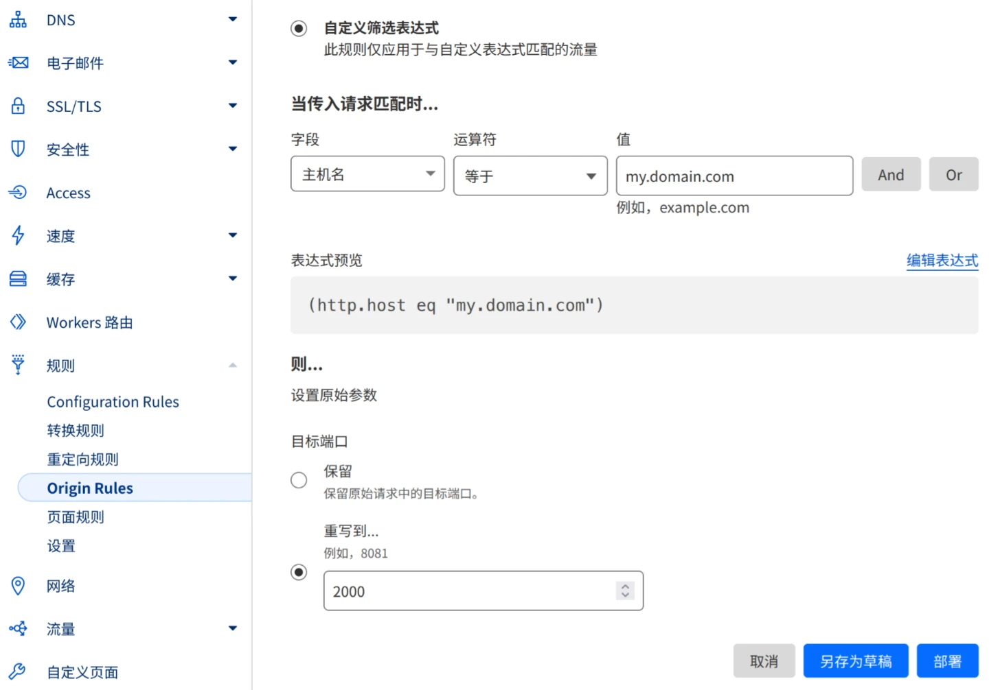

# 国内未备案服务器使用 Cloudflare CDN

通常来说 Cloudflare 在启用代理时仅支持有限的非标 HTTP/HTTPS 端口，且对于国内服务器仅支持 80/443 端口：

> Ports 80 and 443 are the only ports compatible with:
>
> * HTTP/HTTPS traffic within China data centers for domains that have the **China Network** enabled, and
> * Proxying of [Cloudflare Apps](https://cloudflareapps.com/apps/developer/docs/getting-started)

然而 Cloudflare Origin Rules 可以在代理流量时更改包括端口在内的参数：

> 来源规则允许您自定义传入流量的去向以及参数。目前您可以执行以下覆盖：
>
> * Host header: 主机标头：覆盖传入请求的 Host 标头。
> * Server Name Indication (SNI): 服务器名称指示 (SNI)：覆盖传入请求的服务器名称指示 (SNI) 值。
> * DNS record: DNS 记录：覆盖传入请求的已解析主机名。
> * Destination port: 目标端口：覆盖传入请求的已解析目标端口。
>
> 其中，免费用户仅可使用覆写目标端口的功能。

**需求：** 在打开 https://my.domain.com 时，经过 Cloudflare 代理隐藏服务器真实 IP，访问到国内服务器 2000 端口的网站。

## 实际操作：

### 1. 添加 DNS 解析

在 `域名管理-DNS解析`​ 中添加此域名的 A 或 AAAA 记录，解析到要使用的服务器 IP，启用代理（小黄云标志）。

### 2. 新建 Origin Rules

打开 ​[Cloudflare 面板](https://dash.cloudflare.com) ，进入 ​`域名管理-规则-Origin Rules`​ ，创建规则：

示例：​

### 3. 在服务器上开启网站

服务器上 Caddyfile 示例（Nginx 同理）：

```json
https://my.domain.com:2000 {
        encode gzip
        tls /path/to/my.domain.com.cer /path/to/my.domain.com.key
        reverse_proxy localhost:4000
}
```

**注意：** 
如果在 `域名管理-SSL/TLS设置-概述`​ 中启用 `完全`​ 策略，需在服务器上使用 https，使用 `灵活`​ 策略则不需要。如果某个子域名有使用单独策略的需求可以在 `域名管理-规则-Configuration Rules` ​里设置。

---

此时，访问 http(s)://my.domain.com 时，实际访问路径为 `本机 -> Cloudflare -> 服务器IP:2000 -> Cloudflare -> 本机`​，满足需求。

缺点：所有请求走 Cloudflare 代理，对于国内服务器实际会减速。如果不需要 CDN，希望直连访问服务器，可以参考 [《国内服务器搭建网站绕过备案（伪）》](13-https_aya)

## 参考：

1. [Cloudflare Docs: Network ports](https://developers.cloudflare.com/fundamentals/reference/network-ports/)
2. [Cloudflare Blog: Where to? Introducing Origin Rules](https://blog.cloudflare.com/origin-rules)
3. [Cloudflare Docs: Origin Rules](https://developers.cloudflare.com/rules/origin-rules/)
4. [国内服务器搭建网站绕过备案（伪）](13-https_aya)

‍
