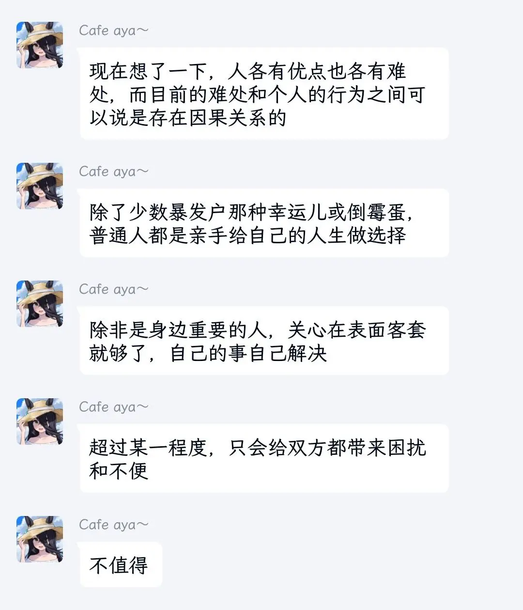
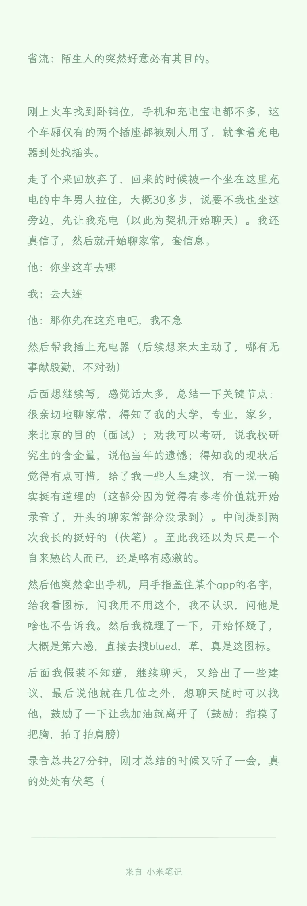

# 最近的一些奇怪记录

在短短四天的北京之行中，我的人生态度与观念就有了不少改变，这是久居象牙塔中所不曾有的。限于我贫瘠的文字表达能力，一些感触只可意会，难以具体描述。

我这种人记性也差，有什么新想法可能也会很快忘记。借此机会稍作总结，希望未来再次回顾这些经历时还能有新收获。

## 1. 经典北上广

工作算是找到了，而我的能力也只能胜任这种程度而己。到时候先在北京实习三个月，然后再到合肥工作。

能力一般的人想在大城市立足实属不易，物价，房租之类都是老生常谈的问题，生活水平可能远不如在老家。作为小地方出来的农村人，这点虽早有耳闻，但唯有亲身经历，以及观察身边人的经历（北京的朋友，同住几天的室友），才能更深刻地体会到其中的艰辛。

还有北京真没啥好玩的（小声），消费巨高，市区里的景点几乎都需要预约。人文景观我没啥兴趣，而自然的又不多，基本都比较偏远（我想去的某处就因为一天仅有两班公交而作罢）。

附：北京四天花费（我个人应该算比较节省的了）

| 吃喝四天 | 交通出行 | 火车来回    | 合计   |
| -------- | -------- | ----------- | ------ |
| 152      | 62.5     | 223+239=462 | 834.5  |

## 2. 放下什么，尊重什么

虽然这个道理早已心知肚明，但近日目睹了自己及他人数个真实案例，才对其有了更深入的理解。

过度依赖的亲密关系往往会埋下意想不到的隐患。依赖他人，一旦面临失去或变故，能否坦然接受，会不会备受打击甚至做出过激行为？而被他人依赖，除非您是圣人在世，能始终如一地无条件关照他人情感，妥善处理人际关系，正确引导他人……然而，圣人真的存在吗？这两种情形有时还会同时出现，使得关系更加错综复杂，难以解决。这不仅无法实现抱团取暖的初衷，反而可能给双方带来不便，造成难以预料的后果。

​
​
## 3. 相见即有缘

偶然间看到了这个视频，正在火车上所以感触良多，仿佛从中见到了自己的人生，遇到了再也不见的人。

[【在中国铁路再次上演《你的名字》名场面】av1202190680](https://www.bilibili.com/video/av1202190680/)

一开始以为只是随手拍的视频，看到后面真的哭了。世界之大，相见即有缘。

和第二点有点矛盾但没本质冲突，以后为人处事方面还得慢慢学习。

## 4. TMD 遇到真男同了

还好没啥恶意，不过也反映了个人防范意识的不足。

<!-- tabs:start -->

#### ** 事件经过 **

​​

#### ** 具体内容 **

<!-- tabs:end -->
